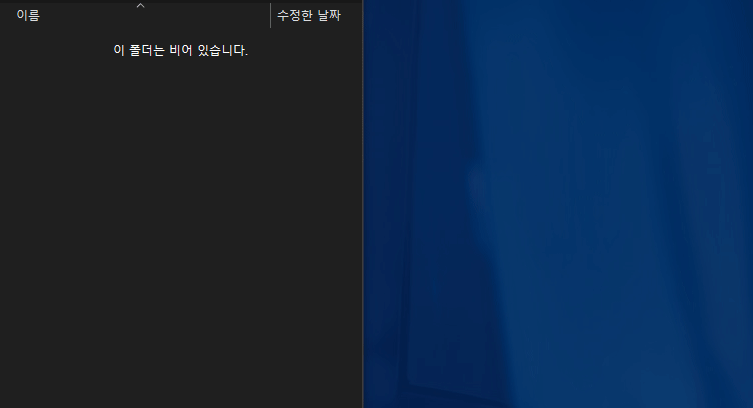
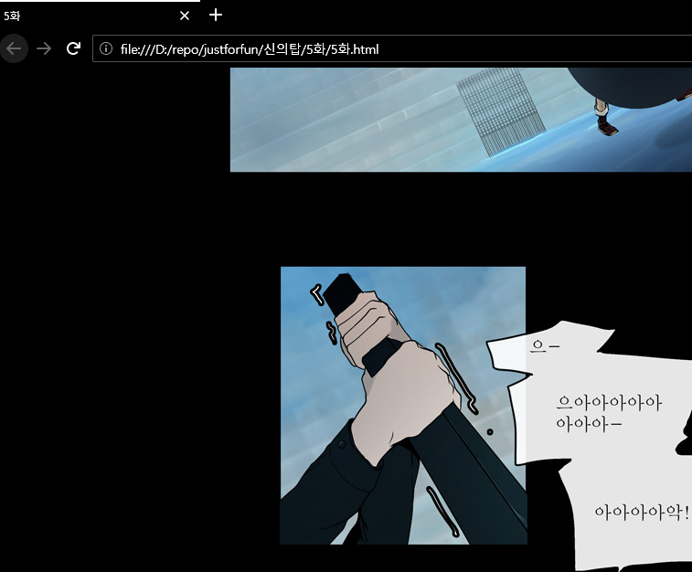

# Naver webtoon/Youtube crawler 

just for fun

## requirements

`pip install requests bs4`

## Usage 

원하는 웹툰을 크롤링 할 수 있도록 `main.py` 를 적절히 수정하세요. **신의탑** 을 크롤링 하고 싶다면 "**신의탑의 최신화 링크**"와 "**신의탑**"을 인자로 전달해야 합니다. 

```python
from webtoon import *

target = (
    'https://comic.naver.com/webtoon/detail.nhn?titleId=183559&no=461&weekday=mon',
    '신의탑'
)
nc = NaverCrawl(*target)
nc.doit()
```

그리고 `main.py` 를 실행하세요. 

`python main.py`



## View 

크롤링 된 이미지를 `.html` 파일로 재조립합니다. `html` 파일을 브라우저로 열어서 만화를 볼 수 있습니다. 

